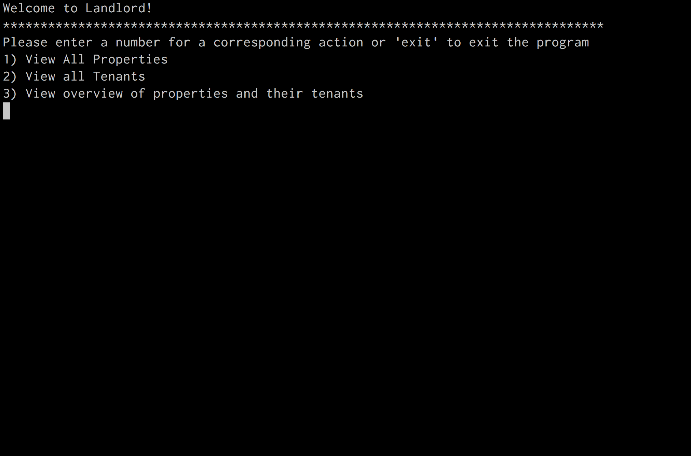

# Intro To Sinatra

## Learning Objectives
- test
- Describe what Sinatra is and what it is used for
- Build a Sinatra app that responds to HTTP requests
- List the HTTP request verbs
- Distinguish between a route and a path
- Define routes with URL parameters and access those parameters
- Access data from the params hash in Sinatra


## Intro (10 minutes)

In unit 1, we learned all about HTML/CSS/JS, and the web. We got
to spend our time building sweet apps and games like Hangman, Tower of Hanoi, etc.

In this most recent unit, we learned about Ruby, an awesome language that can
run outside the browser, makes it easy to save data to a DB and write our
programs using OOP.

But you probably noticed that we've been stuck writing boring CLI apps that
would torture most of our users:

-----



-----

How are we going to put the chocolate of our awesome Ruby skills together with
the peanut butter of our ninja-like HTML skills?

How can we build applications that are backed by *data in a database*, but have
an interface on the *web*?

### Enter Sinatra


Well, maybe not that Sinatra...

## What is Sinatra?

Sinatra  is a **framework** for quickly creating web applications in Ruby with minimal effort. [Frameworks](http://www.infoworld.com/article/2902242/application-development/7-reasons-why-frameworks-are-the-new-programming-languages.html) are similar to libraries, but serve to enforce structure for your codebase.


Other frameworks include Rails, Express / Node.js, Django, PHP, etc.

Let's check out some examples of [Sinatra in the wild.](http://www.sinatrarb.com/wild.html)

Sinatra isn't nearly as prevalent a Ruby framework as Rails, but has a use case when building smaller scale apps because it's minimalistic and lightweight as opposed to the "heaviness" of Rails, which is more apt for a larger production site.

But what do we mean by *web application*?

### What are Web Apps?

A web app is a *program* that can receive HTTP requests (i.e. users can access
it from their browsers). Requests could be something like:

* show me a list of all artists in this app
* show me more info about the artist named 'Drake'
* here's my information, please register me as a user
* show me all tenants in the apartment at '123 Walnut Dr.'
* place the tenant 'Andy Whitley' into the apartment at '42 Wallaby Way, Sydney'
* turn on the lights in my living room

It then *does something* to *process* that request. That could be:

* retrieving the data necessary from a database
* adding info / modifying info in a database
* sending an email
* sending a command to a device connected to the server to turn on some lights

Finally, any good web application is going to *respond* to the request. That
response is almost always going to be an HTML page. Usually, that HTML page
*isn't* an existing HTML file. Instead, the server uses information it has to
*build* the page based on a *template* (more on that later).


## Our first Sinatra app!

Let's create a folder to work in. Create a file called `app.rb` and `Gemfile`.
The file name doesn't matter, but it's easier if we all use the same one.

```bash
$ mkdir sinatra_intro
$ cd sinatra_intro
$ touch app.rb
$ touch Gemfile
```

Let's make sure we include our Sinatra dependency in the `Gemfile`

```ruby
source 'https://rubygems.org'

gem 'sinatra'
```

Then run a `bundle install` in the terminal.

Inside `app.rb`, write:

```ruby
require 'sinatra'

get '/' do
  return 'Hello world!'
end
```

We'll talk about what `get` means later on.

Now, in your terminal, run the file the way you'd run any Ruby file:

```sh
$ ruby app.rb
```

You should see something like:

```
[2015-10-30 13:57:04] INFO  WEBrick 1.3.1
[2015-10-30 13:57:04] INFO  ruby 2.2.1 (2015-02-26) [x86_64-darwin14]
== Sinatra (v1.4.6) has taken the stage on 4567 for development with backup from WEBrick
```

> See the "has taken the stage" thing? There'll be lots of little Sinatra puns
here and there.

Believe it or not, that's it! You now have a server running on your computer. It
can respond to requests, just like any other server. To test that out, go to
`localhost:4567` in your browser. You should see "Hello world!"

> Note that this isn't a server anyone else can see, but it's still a server.

### Where does that `4567` come from?

This is the **port number** of the server we're using. Don't worry about it too
much — just know that to access a Sinatra app on your computer you'll always
use `localhost:4567`, unless someone changes it.

## Routes

The `/` in `get '/'` is the *route* to which someone needs to go to make this
bit of Ruby code run. We can have more than one route in our app!

Try going to `localhost:4567/oh_hello` in your browser. What do we see?

You should get a page saying "Sinatra doesn't know this ditty." That's Sinatra's
404 page. It's saying, "I don't know what to do when someone goes to
`/oh_hello`".

### Mini-Exercise: Add another route (5 minutes)

Add a second `route`, such that when the user visits `/oh_hello`, they see a
page that says: "You just got pranked! That's entirely too much tuna!"

**Bonus** Make the page include an image tag with a tuna sandwich.

Don't forget to restart your server to test your work!

## But I'm getting tired of quitting and restarting!

Fortunately, there's a gem that will automatically restart Sinatra every time a
change is made to your `app.rb`.

Let's create a Gemfile:

```ruby
source 'https://rubygems.org/'

gem 'sinatra'
gem 'sinatra-contrib'
```

> Sinatra-contrib is a gem that packages a lot of functionality. One of those
functionalities is `sinatra/reloader`, which detects every time you save your
`app.rb` file and restarts the server so that it uses the newest version of the
file.

Then run:

```
$ bundle install
```

This should create a `Gemfile.lock`, which you don't need to touch. This file shows the exact versions of the gems you installed so that when your app is loaded on another machine, the same versions will be installed when you run `bundle install`.

Finally, require Sinatra's reloader in your `app.rb`, after requiring Sinatra:

```ruby
require 'sinatra/reloader'
```

## Exercise: Sinatra Games (15 minutes)

Check out the [Sinatra Games](https://github.com/ga-wdi-exercises/sinatra_games) repo.

**Stop at Magic 8 ball**

Note: You can use your current Sinatra app you've been working in... No need to
create a new one.

**Hint** Look up the `Array#sample` method for ones that involve randomness.

Some of them are going to be hard / you don't know enough yet... that's ok... see what you can figure out!

## Getting User Input - The Params Hash

### Demo - `gets.chomp`

It's clear that `gets.chomp` is no way for us to get input from our users.

Instead, we have basically two options on the web:

1. Info from the URL.
2. Info from a submitted form.

Today we're just going to look at option 1.

What does it mean to get info from the URL? Here are some examples -- omitting
the `localhost:4567` part:

* `/artists/4/songs`
* `/say_hello/adam`
* `/forecast/20003`
* `/forecast?zip=20003`
* `/forecast?city=washington,dc&date=tomorrow`
* `/artists?name=drake`
* `/search?name=kroll%20show&format=tv`

> What's up with that `%20`? We can't have spaces in URLs, so we have to
*encode* them.

How can we do this in Sinatra? Using named parameters.

### Named Parameters in the Route

Named parameters are like placeholders in our route. Any info in that part of the
URL will get stored automatically by Sinatra in the params hash for *that
particular request*.

Let's add the following example to our app:

```rb
get '/hi/:name' do
  return "Hi there, #{params[:name]}!"
end
```

Try going to `/hi/you_handsome_devil`. What happens? What if you change the URL?

What does this tell us? **Params is a hash!**. The *keys* are the placeholders
we define in our routes, and the values are the values users include in their
URLs.

### Mini-exercise: Another route w/ Params! (5 minutes)

Try creating a new route that doubles a number. When I go to:

* `/double/2`
  * I should see: `4`
* `/double/8`
  * I should see: `16`

**Hint** you may need to convert a value from params to an integer using `to_i` for
multiplication to work.

### Mini-exercise: Magic Eight Ball (5 minutes)

 Complete the last challenge [in the Sinatra Games exercise](https://github.com/ga-wdi-exercises/sinatra_games).

### Multiple Params

You can have multiple params in one route:


```ruby
get '/fancy_hi/:firstname/:lastname' do
  "Hi! Your name is #{params[:lastname]}. #{params[:firstname]} #{params[:lastname]}"
end
```

It's less common, but you can put params placeholders *around* fixed sections of
the route:

```ruby
get '/:firstname/another_fancy_hi/:lastname' do
  "Hi! Your name is #{params[:lastname]}. #{params[:firstname]} #{params[:lastname]}"
end
```

Add these routes and test them by visiting the correct URLs to trigger them.

### Routes vs Paths

Some terminology:

There are two parts to every HTTP request that Sinatra (and basically any web
framework) cares about: the *VERB* and the *PATH*.

You can't really 'see' the verb. It's usually GET, but not always. It could be:

* GET - for 'getting' info from the server (no data is changed)
* POST - for 'creating' new data on the server (usually by submitting a form)
* PUT - for 'updating' existing data on the server (usually by submitting a form)
* DELETE - for 'deleting' data on the server

The *path* is what you see in the address bar (i.e. everthing in URL after the
  first `/`).

The combination of a VERB + PATH make a *ROUTE*. These little blocks we've been
writing in Sinatra are *routes*. Think of them as `features` or
`things a web app can do`.

## Exercise: 99 Bottles of Beer (15 minutes)

[Exercise Repo](https://github.com/ga-dc/99_bottles_of_beer)

## BREAK (10 minutes)

# [Next: Views](views.md)
